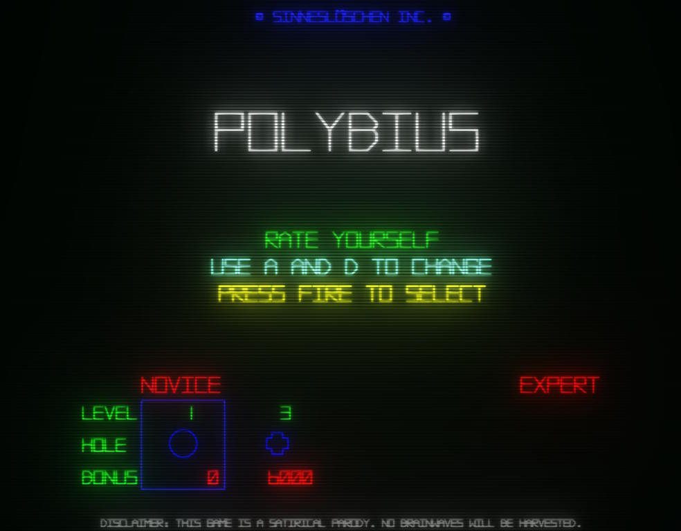

# Polybius

This is a fork of Tempest 2021, aiming to parody the Polybius urban legend (which claimed the infamous Polybius game played similarly to Tempest) and also add new features beyond what were found in Tempest 2021.

Tempest 2021 is a remake of Tempest, an arcade game from 1981 published by Atari. The remake has been created as a university project at a University of Silesia (Uniwersytet Śląski).

That project was created in cooperation with [Piotr Kłosek](https://github.com/Peterka15).

# Play online!
You can play Polybius, just [click here](https://enderandrew.com/polybius/).

Use `A` and `D` to move around, press `Space` to fire.
There is one-time super-weapon called Superzapper - you can use it with `E`.

Game remembers your progress, so after losing one battle you can jump right into another one with same difficulty level.
It's safe to close browser, your high-score won't be gone.

Project is available to play online thanks to GitHub Pages.

# About Polybius
## Technical stuff
Project uses Three.js as a rendering library. It was written purely in JavaScript. I updated this fork to use a newer Vite system and update to the newest Three.js from five year old code.
It's based on vue webpack config, so it can be developed, served and built without any hustle.

## New Features
Added in a sanity system and glitches.

## Licensing
All sounds used in Polybius comes from freesound.org and are published on free-to-use licences.
The VectorBattle font comes from fontspace.com and is published as Non-Commercial freeware.
All other assets were created in-house.
