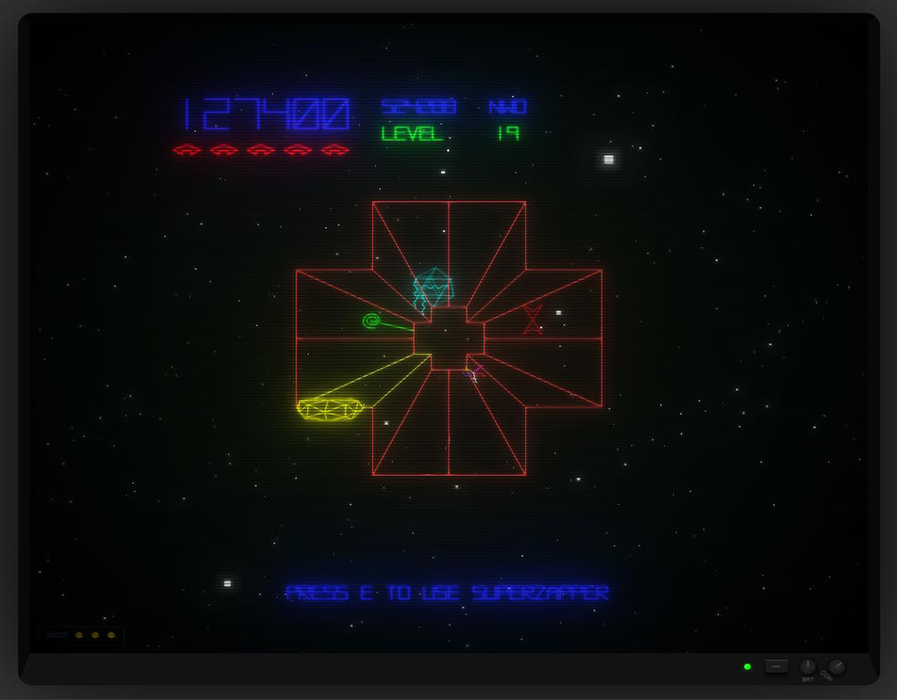
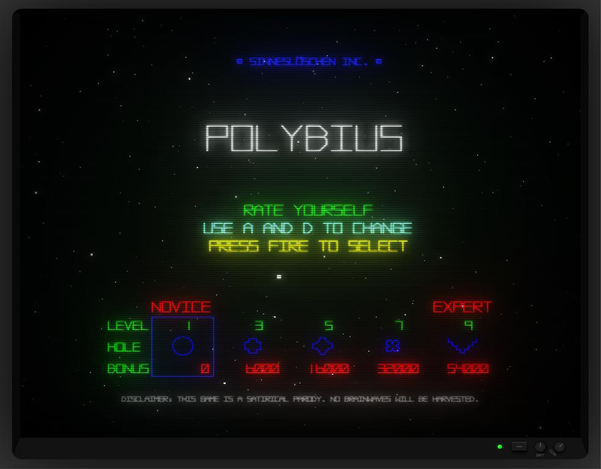

# Polybius

This is a fork of Tempest 2021, aiming to parody the Polybius urban legend (which claimed the infamous Polybius game played similarly to Tempest) and also add new features beyond what were found in Tempest 2021.

Tempest 2021 is a remake of Tempest, an arcade game from 1981 published by Atari. The remake has been created as a university project at a University of Silesia (Uniwersytet Śląski).

That project was created in cooperation with [Piotr Kłosek](https://github.com/Peterka15).

# Play online!
You can play Polybius, just [click here](https://enderandrew.com/polybius/).

Use `A` and `D` to move around, press `Space` to fire.
There is one-time super-weapon called Superzapper - you can use it with `E`.

Game remembers your progress, so after losing one battle you can jump right into another one with same difficulty level.
It's safe to close browser, your high-score won't be gone.

Project is available to play online thanks to GitHub Pages.

# About Polybius
## Technical stuff
Project uses Three.js as a rendering library. It was written purely in JavaScript. I updated this fork to use a newer Vite system and update to the newest Three.js from five year old code.
It's based on vue webpack config, so it can be developed, served and built without any hustle.

## New Features
* Polybius theming
* Random parody message plays between levels (spoken aloud)
* Power-ups
** Particle Blaster - More powerful gun that does double damage
** Jump - Allows you to jump, jump
** Laser - No sharks attached sadly
** Rapid Fire - Fire super fast!
** Spread weapon - Contra?
** 1-Up - Mario?
** Outta Here! - Rare drop of 5000 points and advance to the next stage
** Zappo 2000 - 2000 sweet points 
* Enemy hit points and damage system
* Enemies have a 10% chance of having a shield
* New Enemies:
** Mutant Flippers
** Stealth Flippers
** Demon Heads
** Strong variants of all enemies
* Bonus stage - collect 3 warp tokens and get taken to a bonus stage right out of Superman 64!
* YES EFFECT - pick up a power-up while warping out of a level to trigger an additional bonus power-up
* New controls and gamepad support
* Background music
* Game elements pulse to the beat (bloom + glow)
* Pause screen
* Starfield!
* New sound effects
* Updated to latest Three.js and removed old decorators
* Updated Vite build system
* Added in a sanity system and glitches.

## Licensing
All sounds used in Polybius comes from freesound.org and are published on free-to-use licences.
The VectorBattle font comes from fontspace.com and is published as Non-Commercial freeware.
All other assets were created in-house.
